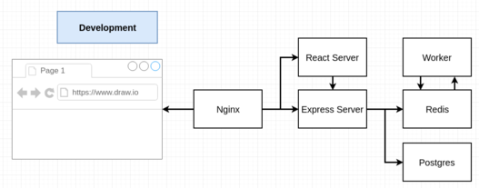
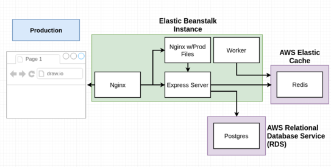

# Project currently down

This project was created by following a tutorial by Stephen Grider in order to better understand the development with Docker flow. DevOps with Docker course, exercise 3.8

Course: Docker and Kubernetes: The Complete Guide
Link: https://twitter.com/ste_grider/status/1032282655453114371

I have created an over the top complex structure for a very simple application. I didn't want to use Kubernetes, or even get into it yet, as practicing Docker is far more relevant to me at the moment. I deployed this application to AWS Elastic Beanstalk with AWS ElastiCache and AWS RDS (PostgreSQL) using multi-container Docker platform and Travis CI. The application incudes the following services:

- Frontend: a React client
- Server: an api service
- Worker: service that calculates the required fibonacci value
- HTTP Server/Router: Nginx
- Cache (delevopment): Redis  
- Cache (production): AWS ElastiCache  
- Database (development): PostgreSQL  
- Database (production): AWS RDS (PostgreSQL)

Application: Fibonacci calculator  
Link: http://fibonaccicalculator-env.4nweb568pu.eu-central-1.elasticbeanstalk.com/
Project repository: https://github.com/shomarov-edu/fibonacci-calcucator
Docker images: https://hub.docker.com/u/shomarov

Diagram's source: https://github.com/StephenGrider/DockerCasts
